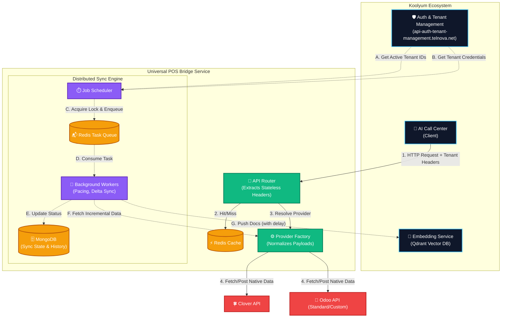
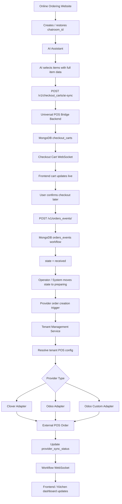
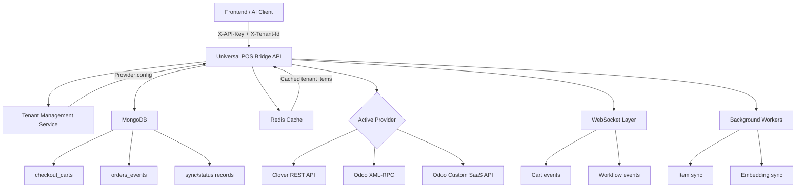
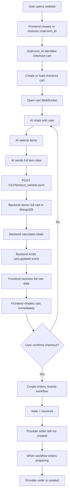
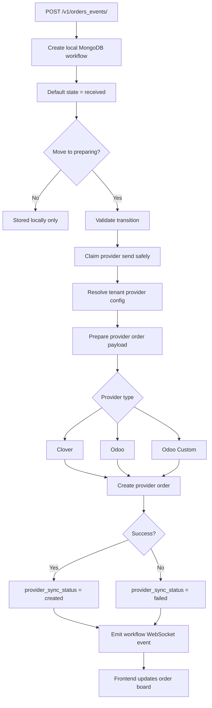
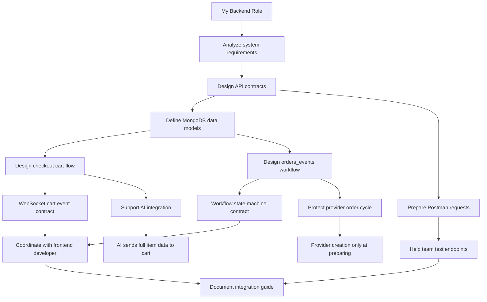

يا هندسة، ده **الملف الشامل (The Master Context File)**. ده بمثابة "الصندوق الأسود" لكل اللي اتناقشنا فيه، مبني ومترتب خصيصاً عشان تاخده `Copy` وتديه لأي AI Agent يشتغل معاك في مشروع **Koolyum**، عشان يفهم الـ Context بالكامل من غير ما يغلط.

تقدر تعتبر ده الـ **Architecture Decision Record (ADR)** لخدمة الـ `ordering_products_service`.

---

# 🧠 Master Context Document: `ordering_products_service` (Koolyum Project)

## 1. Project Overview & Context

* **Parent Project:** Koolyum (A large-scale multi-service ecosystem).
* **Service Name:** `ordering_products_service` (Also known as Universal POS Bridge).
* **Primary Role:** A fully stateless, multi-tenant microservice acting as a universal translation layer between an AI Call Center and disparate POS systems (Clover, Odoo Standard, Odoo Custom SaaS).
* **Secondary Role:** A distributed background synchronization engine that fetches POS catalogs and pushes them to a downstream AI `embedding_service` (Qdrant) for vector search.

## 2. Tech Stack

* **Language/Framework:** Python (FastAPI) or Node.js (Express/Fastify) - *Depending on the final execution stack chosen*.
* **Databases:**
* **Redis:** Used for caching (tenant-isolated), Message Broker (Task Queue), and Distributed Locking.
* **MongoDB:** Used as a State Registry to track sync jobs, statuses, and history.


* **Architecture Patterns:** Stateless API, Factory Design Pattern, Distributed Task Queue, Incremental Sync.

---

## 3. Core Architecture Evolution (How it Works)

Initially, the service was a simple script using `.env` files. It evolved into a Cloud-Native, enterprise-grade architecture.

### A. The Stateless API (Real-time Operations)

* **Problem:** Hardcoding credentials in `.env` limited the service to one company.
* **Solution:** Removed all `.env` dependency for POS credentials. The service requires all configurations (API Keys, DB URLs, Merchant IDs) to be passed via HTTP Headers (`X-Tenant-Id`, `X-Provider`, `X-Clover-Token`, etc.) on every request.
* **Result:** Infinite horizontal scalability. One container can serve 1000s of distinct companies concurrently without cross-contamination.

### B. The Background Sync Engine (Task Queue)

* **Problem:** A simple `cron` loop inside the server would crash or timeout when syncing thousands of products for 50+ companies.
* **Solution:** Built a Distributed Task Queue (using tools like Celery, Arq, or BullMQ).
* **Flow:**
1. Scheduler calls Koolyum's internal `api-auth-tenant-management.telnova.net` to get active `tenantIds`.
2. Scheduler fetches credentials for each tenant and enqueues a "Task" in Redis.
3. Background Workers consume these tasks one by one to fetch items, map payloads, and send them to the `embedding_service`.


---

## 4. Key Challenges Faced & Engineering Solutions (Crucial for AI Agent)

Here are the specific roadblocks we hit and how we engineered our way out of them:

| 🚨 The Problem / Challenge | 🛠️ The Engineered Solution |
| --- | --- |
| **1. Cross-Tenant Data Leaks:** Caching items from one company might accidentally serve them to another. | **Tenant-Isolated Cache Keys:** Enforced Redis cache keys format: `f"{provider}:items:{tenant_id}"`. |
| **2. AI Server Overload (CPU Spikes):** Sending 50,000 items at once to the embedding service crashed it. | **Pacing & Batching:** Enforced a `time.sleep(0.5)` (or async equivalent) delay between webhook calls within the worker loop. |
| **3. Wasting Resources on Full Syncs:** Fetching the entire catalog every 5 minutes was extremely slow and costly. | **Incremental (Delta) Sync:** Utilized MongoDB to store `last_successful_sync_timestamp`. The worker queries the POS for only items modified after this timestamp (`write_date` or `modifiedTime`). |
| **4. RAM Exhaustion on Huge Catalogs:** Pulling 10,000+ items from Clover loaded everything into RAM, causing OOM errors. | **Pagination & Generators:** Implemented continuous pagination loops relying on Python `yield` (Generators) to process and map items one-by-one instead of building massive arrays. |
| **5. Concurrent Sync Collisions:** Two workers picking up the same tenant sync job at the exact same time, ruining Qdrant data. | **Redis Distributed Locks:** Used `SET NX` locks with a TTL before a worker starts a job. If locked, the worker gracefully skips the tenant. |
| **6. Lost "In-Progress" Jobs (Ghost Jobs):** If a worker died unexpectedly, the MongoDB status was stuck "In Progress" forever. | **Stale Job Cleanup:** The Scheduler runs a cleanup sweep before enqueueing new tasks, marking any old "in_progress" jobs as `failed` based on a timeout threshold. |
| **7. Price Data Misinterpretation:** Clover stores $12.50 as `1250` (cents). The AI thought items cost $1250. | **Mandatory Price Normalization:** The mapping layer enforces converting milli-units/cents to human-readable dollar formats before sending text payloads to the embedding service. |

---

## 5. API Contracts & Endpoints

* **Real-time API:** `GET /v1/items`, `POST /v1/orders` (Receives normalized `UnifiedOrder` and standardizes outgoing JSON).
* **Sync Monitoring:** `GET /v1/sync/status/all` (Reads latest statuses from MongoDB directly without hitting POS APIs, enabling fast Dashboard rendering).

---

## 6. System Architecture Diagram (Mermaid Flowchart TD)

Give this code to the Agent or paste it into a Markdown viewer so the structure is visually clear:



---

## 📝 How to use this with the next AI Agent:

When you open a new chat with an AI (like Claude or ChatGPT) to write code for this project, just paste this prompt first:

> *"Act as a Senior Backend Architect. I am working on the `ordering_products_service` inside the Koolyum ecosystem. Below is the complete Master Context Document containing the architecture, tech stack, and the major engineering challenges we've already solved. Read this carefully to understand the exact state of the system before we write any new code or generate CV points."*
> *(Then paste everything above)*


========================================================================================================================================================================================================================
يا هندسة، الملف ده هو "عصارة" تفكير وتخطيط لمشروع من العيار الثقيل. دلوقتي إنت جاهز تاخد الملف ده وتشتغل بيه في أي حتة سواء كود أو CV أو انترفيوهات! بالتوفيق يا وحش! 🚀

Yes, Boss. You can present this as a **real backend portfolio project**: multi-tenant online ordering + POS bridge + AI checkout cart + local order workflow.

Use this title:

```text
Backend Engineer — Universal POS Bridge & AI Online Ordering Workflow
```

The project connects frontend, AI, tenant-management, POS providers, MongoDB workflow records, WebSockets, and provider adapters. The bridge is documented as a tenant-based POS API where clients send `X-API-Key` and `X-Tenant-Id`, while the backend resolves the active provider internally instead of exposing Clover/Odoo credentials to clients. 

---

## CV Version

```md
## Universal POS Bridge & AI Online Ordering Backend

Worked as a Backend Developer on a multi-tenant POS bridge and AI-powered online ordering system that connects public ordering websites, tenant-management, checkout carts, local order workflows, and external POS providers including Clover, Odoo, and Odoo Custom.

### My Role

- Built backend flows for tenant-scoped POS operations using `X-Tenant-Id`, where the service resolves provider configuration internally through tenant-management instead of exposing provider credentials to clients.
- Developed and documented MongoDB-backed `orders_events` workflows to manage internal order states independently from provider-native order lifecycles.
- Implemented/extended order workflow logic with states such as `received`, `preparing`, `ready`, and `done`, while keeping provider order creation triggered only when the workflow first enters `preparing`.
- Worked on guest checkout cart planning and API design using `chatroom_id` as the cart identifier, supporting AI-driven cart updates with full item data and WebSocket live updates.
- Designed backend contracts for WebSocket events so the frontend can receive live cart/workflow updates without repeatedly polling the API.
- Collaborated with frontend, AI, and infrastructure teammates by preparing backend API contracts, Postman flows, technical documentation, and deployment-ready integration steps.
- Helped keep provider integrations isolated from frontend logic, so the same public API can work with Clover, Standard Odoo, and Odoo Custom tenants.
```

---

## Strong CV Bullet Points

```md
- Developed backend APIs for a multi-tenant Universal POS Bridge supporting Clover, Odoo, and Odoo Custom through tenant-based provider resolution.
- Designed MongoDB-backed order workflow records with state transitions, provider sync tracking, retry handling, and safe failure persistence.
- Implemented backend contracts for guest checkout carts identified by `chatroom_id`, enabling AI-driven cart updates and real-time WebSocket synchronization.
- Created API documentation and Postman testing flows for frontend/backend integration, including checkout carts, items, categories, orders, and workflow events.
- Collaborated with frontend, AI, and DevOps teams to connect public online ordering, tenant-management, POS bridge APIs, WebSocket events, and server deployment flow.
```

---

## Portfolio Description

```md
# Universal POS Bridge & AI Online Ordering Backend

## Project Summary

Universal POS Bridge is a multi-tenant backend service that exposes one unified API for online ordering, catalog management, guest checkout carts, local order workflows, and POS provider integration.

The system supports multiple POS providers including Clover, Standard Odoo, and Odoo Custom. Instead of making the frontend deal with provider-specific credentials or APIs, the backend receives a tenant ID, resolves the tenant’s POS configuration through tenant-management, and routes the request to the correct provider adapter.

## Problem

Different restaurants or businesses may use different POS providers. The frontend and AI ordering experience should not need to know whether a tenant uses Clover, Odoo, or Odoo Custom.

The system needed:

- one unified backend API
- tenant-based provider resolution
- guest checkout cart without user login
- AI-driven cart updates
- local operational order workflow
- WebSocket updates for frontend
- safe provider order creation
- retry and failure handling

## Solution

I worked on the backend layer that connects:

- online ordering frontend
- AI chat/order assistant
- tenant-management service
- checkout cart APIs
- MongoDB workflow records
- WebSocket events
- Clover/Odoo/Odoo Custom provider adapters

The backend keeps checkout carts separate from order workflows. Checkout carts are guest baskets stored in MongoDB and identified by `chatroom_id`. Provider orders are not created from the cart directly. Instead, a future checkout step creates an `orders_events` workflow, and provider order creation happens only when the workflow enters `preparing`.

## Backend Responsibilities

- Designed tenant-scoped API contracts.
- Planned and documented checkout cart APIs.
- Built backend workflow strategy for `orders_events`.
- Defined WebSocket event contracts for carts and workflows.
- Protected the order lifecycle from duplicate provider creation.
- Prepared Postman collections and frontend integration documentation.
- Coordinated with frontend and AI developers on request/response contracts.
```

The checkout cart is explicitly documented as a guest pre-order basket stored in MongoDB; it does not create provider orders and does not replace `orders_events`. Provider order creation remains controlled by the workflow transition into `preparing`. 

---

## Main System Flowchart TD



---

## Backend Service Connection Flow



The bridge is documented as exposing one tenant-based API for catalog, categories, item images, direct orders, local workflows, live workflow events, and sync status; the frontend should use the bridge only and should not call Clover, Odoo, or Odoo Custom directly. 

---

## Checkout Cart Flowchart TD



The frontend integration guide states that `chatroom_id` is the cart identifier, there is no separate generated `cart_id`, and it should be stored in localStorage and reused across visits. It also documents AI sync as storing full item payload directly, avoiding provider lookups, recalculating totals locally, and emitting WebSocket events with the same full item data. 

---

## Order Workflow Flowchart TD



The workflow docs describe `orders_events` as a separate internal workflow resource backed by MongoDB. Providers do not own the internal lifecycle, and MongoDB is the source of truth for workflow progression. 

---

## My Role Flowchart TD



---

## What I Actually Did — Portfolio-Friendly

```md
## What I Did

I worked on the backend side of a multi-service online ordering system. My work focused on designing and implementing backend flows that connect the online menu, AI assistant, checkout cart, tenant-management, POS bridge, local order workflows, and provider adapters.

I helped define how services communicate synchronously through HTTP and how live updates are delivered through WebSockets. I also worked on the order workflow rules to make sure provider order creation happens safely only at the correct lifecycle stage.

I collaborated with frontend and AI teammates by preparing clear request/response contracts, WebSocket event structures, Postman collections, and integration documentation. This helped the frontend team connect the cart and workflow UI without needing to understand Clover, Odoo, or Odoo Custom internals.
```

---

## Teamwork / Collaboration Section

```md
## Collaboration

- Worked with frontend developers to define API contracts, required headers, localStorage keys, and WebSocket event payloads.
- Worked with AI/automation developers to support AI-driven checkout cart updates using `chatroom_id` and full item data.
- Coordinated with DevOps/server work for deployment, Docker containers, Nginx routing, and production API URLs.
- Prepared Postman collections and technical documentation so the team could test APIs consistently.
- Helped protect existing business logic by keeping checkout cart separate from order workflow and keeping provider order creation controlled by `orders_events`.
```

---

## Skills To Put Under This Project

```text
FastAPI
Python
MongoDB
Redis
Celery / background workers
WebSockets
REST APIs
Docker
Nginx
Multi-tenant architecture
Microservices communication
POS integration
Clover API
Odoo integration
API documentation
Postman
Backend system design
State machine design
Idempotency and retry handling
```

Use only the ones you are comfortable defending in an interview.

---

## Best Short Version For LinkedIn / Portfolio

```md
Built backend components for a multi-tenant Universal POS Bridge and AI-powered online ordering system. The platform connects public ordering websites, AI checkout flows, tenant-management, MongoDB-backed guest carts, local order workflows, WebSocket updates, and POS providers such as Clover, Odoo, and Odoo Custom.

My backend work included tenant-scoped API contracts, checkout cart flow design using `chatroom_id`, WebSocket event contracts, MongoDB workflow records, provider sync lifecycle planning, Postman testing flows, and documentation for frontend and AI integration.
```
